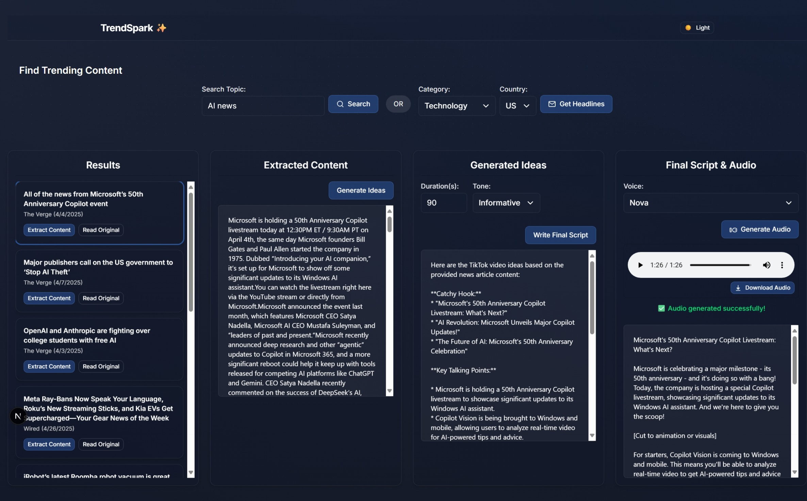

# ✨ TrendSpark


> The ultimate AI-powered content pipeline with a beautiful glassmorphic UI

🔗 **[Live Demo: https://trendspark.vercel.app/](https://trendspark.vercel.app/)**

TrendSpark is a cutting-edge web application that leverages the power of multiple AI models to help content creators discover trending topics, generate innovative content ideas, craft compelling scripts, and produce professional audio — all within a sleek, modern glassmorphic interface.

<div align="center">
  
  <p><em>TrendSpark interface showing the AI content generation workflow</em></p>
</div>

## 🚀 Features

### 🔍 Multi-Agent AI Content Pipeline

TrendSpark features a seamless, AI-driven content generation workflow:

1. **Trend Discovery Agent** - Find trending content across multiple categories and regions
2. **Content Extraction Agent** - Extract and analyze articles from any URL
3. **Idea Generation Agent** - Transform trending topics into creative content ideas
4. **Script Creation Agent** - Develop polished scripts with customizable tones and durations
5. **Audio Synthesis Agent** - Convert scripts into natural-sounding speech with multiple voice options

### 💎 Modern Glassmorphic UI

- Custom-built, reusable glass-effect components (GlassButton, GlassCard, GlassForm, etc.)
- Beautiful animated background gradients
- Smooth micro-interactions and transitions powered by Framer Motion
- Light/Dark theme support
- Responsive design for all devices

### 🧠 Advanced AI Integration

- **News API** integration for real-time trend discovery
- **GROQ** high-performance AI for content and script generation
- **OpenAI** voice synthesis for professional-quality audio output
- **Extractus** article extraction for in-depth content analysis

## 🛠️ Tech Stack

- **Frontend**: Next.js 15.3.1 with React 19, TypeScript, TailwindCSS 4
- **Styling**: Custom glassmorphism components, Framer Motion animations
- **AI Models**: GROQ, OpenAI
- **API Handling**: Axios, SWR
- **Form Handling**: React Hook Form

## 📊 TrendSpark in Action

TrendSpark enables you to:

- **Discover Trends** by searching for keywords or browsing categories like technology, business, entertainment, health, science, and sports
- **Customize Searches** by selecting from 8 different countries (US, UK, Canada, Australia, Germany, France, Japan, Korea)
- **Generate Ideas** with AI that understands context and current trends
- **Craft Scripts** with 6 different tones: informative, excited, neutral, humorous, serious, casual
- **Create Audio** with 6 high-quality AI voices: alloy, echo, fable, onyx, nova, shimmer

## 🚀 Installation

### Prerequisites

- Node.js (v18+)
- npm or yarn

### Environment Setup

Create a `.env.local` file with the following required API keys:

```
NEWS_API_KEY=your_news_api_key
GROQ_API_KEY=your_groq_api_key
OPENAI_API_KEY=your_openai_api_key
```

### Quick Start

```bash
# Clone the repository
git clone https://github.com/yourusername/trendspark.git

# Navigate to the project folder
cd trendspark

# Install dependencies
npm install
# or
yarn install

# Run development server
npm run dev
# or
yarn dev
```

Open [http://localhost:3000](http://localhost:3000) to see the application in action.

## 🔄 Workflow Example

1. **Enter a keyword** or select a category to discover trending content
2. **Select an article** to extract its content for analysis
3. **Generate creative ideas** based on the extracted content
4. **Craft a script** with your preferred tone and duration
5. **Create audio** with your chosen AI voice
6. **Download and share** your content!

## 🌐 API Structure

TrendSpark features 5 integrated API routes:

- `/api/trends` - Fetches trending articles based on keywords, category, and country
- `/api/extract` - Extracts and processes article content from URLs
- `/api/ideas` - Generates content ideas from extracted text
- `/api/script` - Creates scripts with specified tone and duration
- `/api/audio` - Converts scripts into downloadable audio files

## 🧩 Glassmorphic Component System

TrendSpark includes a custom-built glassmorphic UI component library in the `components/glass` directory:

- GlassButton - Animated, translucent buttons with hover effects
- GlassCard - Content containers with frosted glass effect
- GlassForm - Input elements with glassmorphic styling
- GlassModal - Overlay dialogs with backdrop blur
- GlassNavigation - Navigation elements with transparent effects
- GlassSpinner - Loading indicator with glass styling

## 🚢 Deployment

TrendSpark is deployed on Vercel's platform for optimal performance and reliability:

- **Live Application**: [https://trendspark.vercel.app/](https://trendspark.vercel.app/)
- **Infrastructure**: Vercel's Edge Network
- **CI/CD**: Automatic deployment from the main branch
- **Environment Variables**: API keys securely managed through Vercel's environment configuration
